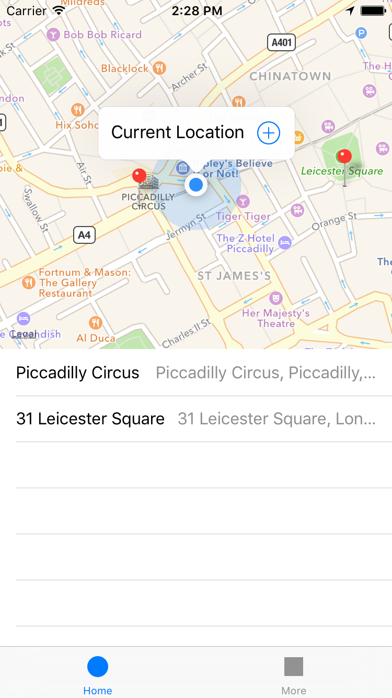

## Simple Pins

When you are somewhere, and you want to save this place, you just open an application, and in easy way pin up current location. After some time - you should be able to open application, and see all places pinned by you.

Built with Xcode 7.3.1
Using Swift 2.2
For iOS 8.0 or later
Using Cocoapods as dependency manager

Features:
* Facebook sign in using pure OAuth calls and fetch basic info.
* Store, move, delete pins on map. Pins are persistently stored in db using CoreData.

